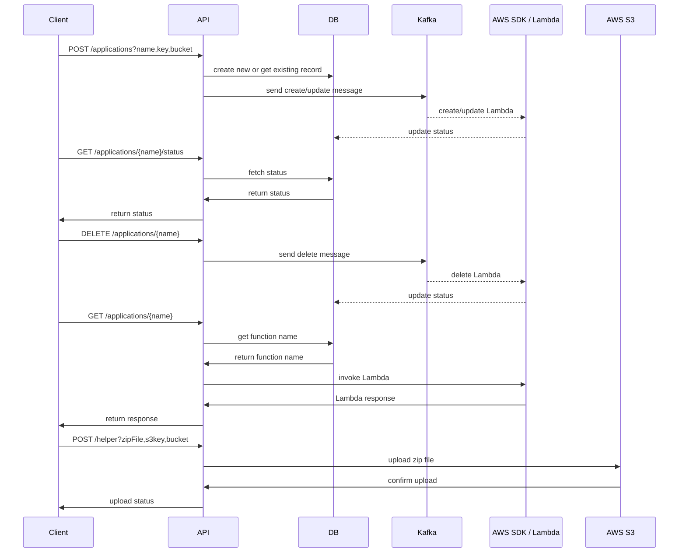
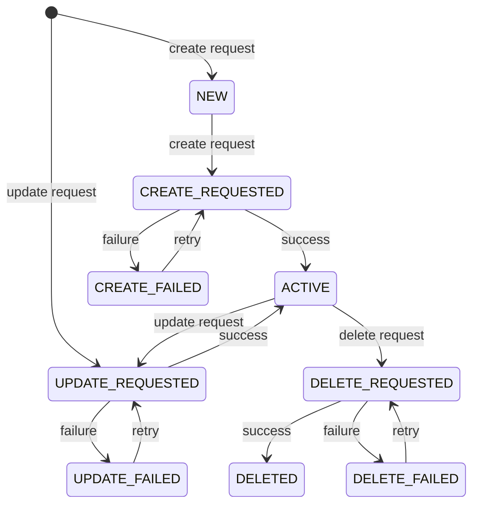

# Deployment Manager App

REST API application to manage AWS Lambdas using LocalStack in Docker:

- Upload ZIP files to a specified S3 bucket
- Create, update, or delete Lambda functions
- Check Lambda status
- Re-deploy updated files if already deployed
- Reverse proxy for Lambda invocation

## Sequence Diagram


## Application Deployment State Diagram


## Requirements

- Java 17
- Docker (required for local infrastructure)

## Tech Stack

- Kotlin
- Spring Boot
- PostgreSQL
- Kafka
- Flyway
- LocalStack (Lambda, S3)

## Run with Local Profile

```bash
./gradlew bootRun --args='--spring.profiles.active=local'
```

Infrastructure will be created automatically. Port ``8080``.

## Local Infrastructure

The local environment uses Docker containers for:

- PostgreSQL
- Kafka
- LocalStack
- Flyway (DB migrations)

Automatically created:

- S3 Bucket ``deployments``
- PostgreSQL DB ``dm``
- topic ``dm-deployment-topic-local``.

### LocalStack Init Scripts

LocalStack init scripts are located in:

```
init-functions
```

### Database Migrations

Flyway migrations are located in:

```
src/main/resources/db/migration
```

## Metrics

Prometheus endpoint ``localhost:8080/actuator/prometheus``

- Kafka metrics start with ``kafka_consumer_``

- AWS metrics start with ``aws_sdk_lambda_`` and ``aws_sdk_s3_``:
  - ``aws_sdk_lambda_ApiCallDuration_seconds_max``
  - ``aws_sdk_s3_ApiCallDuration_seconds_max``
  - ...

- HTTP key metrics:
  - ``http_server_requests_seconds_max``
  - ``http_server_requests_seconds_count``
  - ``http_server_requests_seconds_sum``
  - ...

- Application key metrics:
  - ``application_ready_time_seconds``
  - ``jvm_memory_used_bytes``
  - ``system_cpu_usage``
  - ``jvm_gc_pause_seconds_max``
  - ``jvm_gc_pause_seconds_count``
  - ``jvm_gc_pause_seconds_sum``
  - ``tomcat_sessions_active_current_sessions``
  - ...

- DB related metrics:
  - ``spring_data_repository_invocations_seconds_max``
  - ``spring_data_repository_invocations_seconds_count``
  - ``spring_data_repository_invocations_seconds_sum``
  - ``hikaricp_connections_active``
  - ``hikaricp_connections_creation_seconds_max``
  - ...
